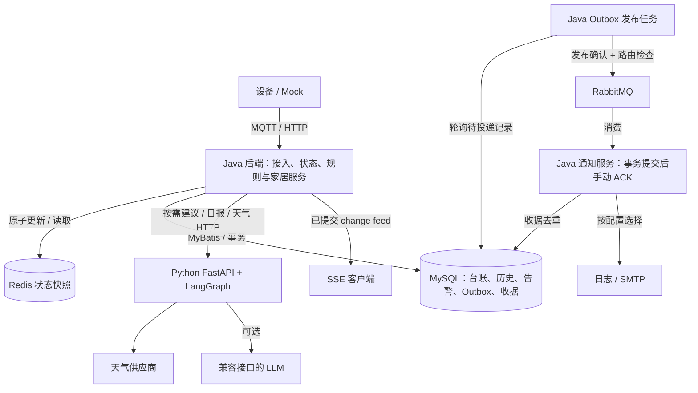

# Intelli Home

面向单家庭的智能家居后端实验项目：接入设备遥测，维护状态和历史，执行安全规则并异步通知；通过独立 Python Agent 提供天气上下文和生活建议。

项目用于本地开发和工程实践，支持 Mock 演示与真实 MQTT Broker 接入。设备控制目前仅支持模拟开关，没有真实硬件驱动或公网鉴权。

## 核心能力

- **设备与状态**：MQTT / HTTP Mock 接入、物模型、Redis 快照、乱序处理、属性新鲜度、离线检测与 MySQL 启动恢复。
- **告警与通知**：火灾风险和离线规则、参数配置、告警与 Outbox 同事务落库、RabbitMQ 发布确认、通知收据去重、重试与死信；日志通知默认启用，SMTP 可选。
- **家居扩展**：遥测历史与聚合、SSE 基线和有限重放、页面定义版本、规则试运行、天气驱动的收衣提醒、模拟命令与回执状态机。
- **生活建议**：FastAPI + LangGraph 按需建议与日报；模型缺失或失败时返回模板并标明降级，天气缺失不推断为晴天。Java 负责确定性安全判断。

## 架构



Java 图中各职责属于同一后端进程。日报使用独立调度线程，直接发送邮件并记录收据，不经过告警 Outbox。SSE 从 MySQL 已提交变更读取，不消费通知队列。

交互架构图及源码依据见 [architecture/](architecture/README.md)。

## 仓库布局与获取

项目采用单仓库布局，Java、Python、基础设施、契约和演示脚本一并获取：

```text
intelli-home-assistance/
├── intelli-home/            Java 服务
├── intelli-home-agent/      Python Agent
├── infra/                  本地中间件配置
├── contracts/              MQTT、Agent、REST 与 JSON Schema
├── scripts/                演示及验证脚本
└── architecture/           架构文档与交互图
```

```powershell
git clone https://github.com/xiaoyanfufu/intelli-home-assistance.git
cd intelli-home-assistance
```

服务目录名称是脚本和文档链接的约定，无需单独克隆服务或初始化 submodule。

## 快速启动

需要 Java 21、Maven、Docker Compose、Python 3.12 和 PowerShell。以下命令从工作区根目录执行，各服务分别开终端。

### 1. 中间件

```powershell
docker compose -f infra/docker-compose.yml up -d --wait
```

启动 MySQL、Redis、RabbitMQ 和 EMQX。默认端口仅绑定 `127.0.0.1`；账号仅供本地演示。全新空数据库由 Java 启动时通过 Flyway V1–V4 初始化。旧版本数据库接管见 [Java 运行说明](intelli-home/FEATURES.md)，不要通过删除数据卷升级。

### 2. Python Agent

```powershell
cd intelli-home-agent
python -m venv .venv
.venv/Scripts/python.exe -m pip install -r requirements-lock.txt
.venv/Scripts/python.exe -m pip install --no-deps --no-build-isolation -e .
.venv/Scripts/python.exe -m uvicorn intelli_agent.main:app --host 127.0.0.1 --port 8000
```

不需要填写模型密钥即可演示降级建议。需要外部天气或模型时，参考 [.env.example](intelli-home-agent/.env.example)，将真实配置放在被忽略的 `.env` 中。

### 3. Java 后端

```powershell
cd intelli-home
$env:AGENT_ENABLED='true'
mvn clean package
java -jar target/intelli-home-0.1.0-SNAPSHOT.jar
```

后端默认监听 `127.0.0.1:8080`。Agent 可选：不启动 Python 时保留 `AGENT_ENABLED=false`。

### 4. 演示

```powershell
./scripts/demo.ps1
./scripts/demo-features.ps1
```

第一条演示状态、建议、火灾风险和告警查询；第二条演示能力发现、历史与页面版本。演示会保留设备、历史及告警数据。模拟控制和模拟天气需显式开启，见 [家居扩展说明](contracts/home-features.md)。

## 验证

```powershell
# Java 单元测试与格式检查，无需中间件
mvn -f intelli-home/pom.xml test spotless:check

# Python 单元测试
Push-Location intelli-home-agent
./.venv/Scripts/python.exe -m pytest -q
Pop-Location

# 完整集成与 Broker 故障验证；先启动基础设施，安装 Python 环境
./scripts/verify.ps1
```

完整验证需要 Docker 权限及空闲的本地 5673 端口，会创建并清理独立临时 RabbitMQ 容器。Java 集成测试默认跳过；`verify.ps1` 显式启用，并覆盖迁移、重复消息、事务回滚、缓存恢复、MQ 重试/死信、MQTT 和家居扩展。SMTP 自动测试使用本地测试服务，不能证明公网邮箱已收件。

## 接口文档

| 内容 | 文档 |
|---|---|
| REST 路径与请求结构 | [OpenAPI](contracts/openapi.yaml) |
| MQTT 遥测、命令与回执 | [MQTT 协议](contracts/mqtt/README.md) |
| Java / Python 交互 | [Agent API](contracts/agent-api.md) |
| 邮件、日报与预览 | [日报说明](contracts/daily-advice.md) |
| 历史、SSE、页面、规则与控制 | [家居扩展](contracts/home-features.md) |
| Java 分层与持久化 | [Java README](intelli-home/README.md) |

## 一致性与部署边界

- 当前支持单家庭、单后端实例；没有生产鉴权、多租户或 Outbox 多实例抢占。
- Redis 与 MySQL 不在同一事务中；没有持久入站事件日志与完整恢复进度，不能保证设备事件跨进程崩溃零丢失。
- Outbox 保证告警数据库事务范围内的恢复投递；通知收据支持重复消费去重，但 SMTP 接受后数据库提交失败仍可能重复发送。
- SSE 有限保留且最多 8 个连接；页面保存的是受控定义，不是可执行 HTML / JavaScript。
- 真实硬件、前端页面渲染、多家庭与公网部署尚未实现。

项目采用 [MIT License](LICENSE)，架构查看器的第三方声明见 [THIRD_PARTY_NOTICES.md](THIRD_PARTY_NOTICES.md)。
